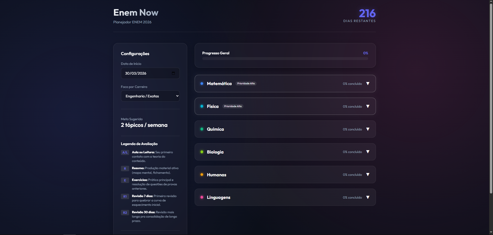

# EnemNow - Planejador ENEM 2026

## Sobre o Projeto
O Planejador para o ENEM 2026 é uma aplicação web feita com tecnologias nativas (HTML, CSS e JavaScript), projetada para auxiliar estudantes a organizarem sua rotina de estudos de forma inteligente e adaptável. Ao invés de depender de um cronograma engessado, a aplicação calcula o ritmo ideal de estudos cruzando o total de tópicos pendentes com a quantidade de dias restantes até o exame oficial.

## Principais Funcionalidades
* **Contagem Regressiva e Dashboard Integrado:** O painel principal fornece visão limpa e instantânea do andamento das tarefas, progresso por matéria e quantos dias faltam para a prova do ENEM.
* **Direcionamento por Áreas (Pesos de Carreira):** Ao selecionar sua área (como Exatas, Ciências da Saúde, Direto, etc.), o sistema destaca as matérias que requerem maior enfoque ou dedicação baseadas em pesos convencionais universitários.
* **Ritmo Dinâmico Contínuo (Pace):** Como ele leva em consideração a data atual, os eventuais atrasos ajustarão automaticamente sua "Meta Sugerida" da semana para garantir que todas as obrigações sejam cumpridas até a véspera.
* **Persistência de Dados via LocalStorage:** Tudo é salvo automaticamente em seu navegador local, dispensando o uso de contas, internet permanente ou cadastros.
* **Exportação e Importação Remota (Backup):** É possível baixar seu estado atual completo e continuar o preenchimento de outro dispositivo.

## Estrutura Metodológica de Avaliação
Baseado no ciclo de aprendizagem iterativo (estudo ativo, revisão e prática repetitiva), cada minitópico contém 5 marcadores cruciais de avanço:
* **A/L (Aula ou Leitura):** Consumo inicial e focado do conteúdo.
* **R (Resumo):** Criação ou estruturação do seu próprio guia de revisão pontual.
* **E (Exercícios):** Execução fundamental e prática exaustiva de provas/simulados sobre o conteúdo visto.
* **R1 (Revisão 7 dias):** Revisitação do resumo/exercícios na primeira semana de estudo para quebra da fase inicial da curva de esquecimento humana.
* **R2 (Revisão 30 dias):** Consolidação profunda para que ele atinja com segurança sua memória de longo prazo.

## Requisitos e Como Executar
O projeto não exige gerenciadores de pacotes ou terminais de construção complexos.
1. Extraia e garanta que os arquivos `index.html`, `style.css` e `script.js` estejam na mesma pasta do seu sistema operacional.
2. Abra o arquivo `index.html` em qualquer navegador compatível (Edge, Chrome, Firefox, Safari).
3. Comece a configurar e definir seu progresso. Para continuar do celular, exporte os dados.

## Estrutura do Código
* `index.html`: A base esquelética da dashboard e todos os blocos estruturais do formulário.
* `style.css`: Estilização das caixas modais transparentes e modo dark nativo estético. 
* `script.js`: Cálculos das fórmulas, lógica de iteração dos arquivos e chamadas de salvamento na memória do disco.
